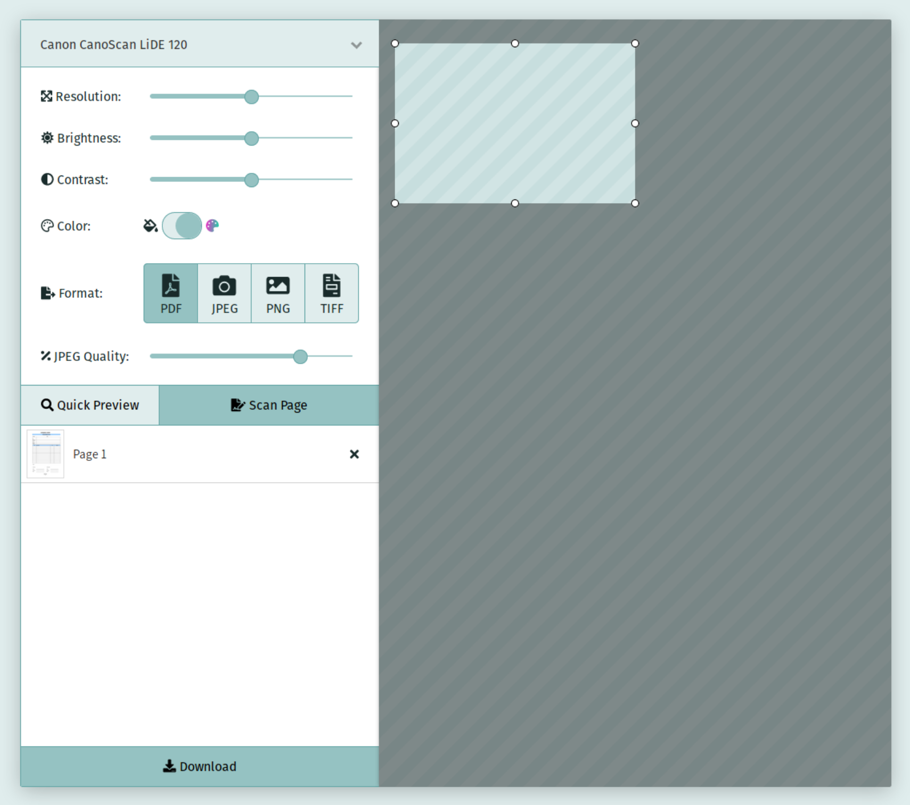

# sane-webscan
An extremely powerful and lightweight web scan server for SANE, inspired by [scanservjs](https://github.com/sbs20/scanservjs).
This application is currently under development and does not work yet, but will support the following features:

- scanner button support (including copying)
- PDF with OCR and multiple pages
- scanner selection
- single binary

TODO:
- device blacklist
- option mappings for devices
- 



## Installation on an Orange Pi Zero with Armbian Bionic
```bash
# For easy access at http://scanner/
hostnamectl set-hostname scanner

# Enable 1GB swap for GCC
dd if=/dev/zero of=/var/swap bs=1024 count=1048576
chmod 600 /var/swap
mkswap -f /var/swap
swapon /var/swap

# Install requirements
sudo apt-get install -y sane cups libsane-dev libsane1 pdfsandwich tesseract-deu golang # libsane-hpaio hplip

# Install sane-webscan
go get -u teahub.io/momar/sane-webscan
wget https://teahub.io/momar/sane-webscan/raw/branch/master/sane-webscan.service -O /etc/systemd/system/sane-webscan.service
systemctl enable sane-webscan.service
systemctl start sane-webscan.service

# Enable CUPS web interface on port 631
cupsctl --remote-admin --remote-any --share-printers
```
